# Карта діалогових вікон — ResumeBuilder

> Відкрити у [mermaid.live](https://mermaid.live) або у будь-якому редакторі з підтримкою Mermaid (VS Code + розширення «Markdown Preview Mermaid Support», GitHub, Notion).

```mermaid
flowchart TB
    classDef page     fill:#fffde7,stroke:#f9a825,stroke-width:2px,color:#333,font-weight:bold
    classDef modal    fill:#e8f5e9,stroke:#66bb6a,stroke-width:2px,color:#333
    classDef authFlow stroke-dasharray:5 5,stroke:#e57373,fill:#fff

    %% ── ПУБЛІЧНІ СТОРІНКИ ──────────────────────────────────────────
    subgraph PUBLIC ["🌐  Публічні сторінки"]
        direction TB
        HOME["Головна\n(/)"]:::page
        LOGIN["Вхід\n(/login)"]:::page
        REGISTER["Реєстрація\n(/register)"]:::page
    end

    %% ── СТОРІНКИ КОРИСТУВАЧА ───────────────────────────────────────
    subgraph USER ["👤  Сторінки користувача  (потребують авторизації)"]
        direction TB
        DASHBOARD["Дашборд\n(/dashboard)"]:::page
        EDIT["Редактор резюме\n(/resume/[id]/edit)"]:::page
        PREVIEW["Перегляд резюме  (PDF)\n(/resume/[id]/preview)"]:::page
        EXPERTS["Каталог фахівців\n(/shared/experts)"]:::page
        SHARED_RESUME["Публічне резюме\n(/shared/resume/[share_id])"]:::page
    end

    %% ── АДМІН-ПАНЕЛЬ ───────────────────────────────────────────────
    subgraph ADMIN_SECTION ["🔒  Адмін-панель  (тільки роль ADMIN)"]
        direction TB
        ADMIN["Адмін: Дашборд\n(/admin)"]:::page
        ADMIN_TEMPLATES["Адмін: Шаблони\n(/admin/templates)"]:::page
        ADMIN_USERS["Адмін: Користувачі\n(/admin/users)"]:::page
    end

    %% ── МОДАЛЬНІ ВІКНА ─────────────────────────────────────────────
    subgraph MODALS ["💬  Модальні вікна  (без зміни URL)"]
        direction LR
        SETTINGS_MODAL["Налаштування\n(SettingsModal)"]:::modal
        DELETE_MODAL["Видалення резюме\n(DeleteResumeButton)"]:::modal
        PUBLIC_MODAL["Публічний доступ\n(PublicToggle)"]:::modal
        TEMPLATE_MODAL["Додати / Редагувати шаблон\n(TemplatesClient)"]:::modal
    end

    %% ────────────────────────────────────────────────────────────────
    %% НАВІГАЦІЯ: Головна
    HOME -->|"Натиснути 'Увійти'"| LOGIN
    HOME -->|"Натиснути 'Розпочати'"| DASHBOARD

    %% НАВІГАЦІЯ: Вхід
    LOGIN -->|"Надіслати форму (успішно)"| DASHBOARD
    LOGIN -->|"Натиснути 'Створити акаунт'"| REGISTER

    %% НАВІГАЦІЯ: Реєстрація
    REGISTER -->|"Надіслати форму (успішно)"| LOGIN
    REGISTER -->|"Натиснути 'Увійти'"| LOGIN

    %% НАВІГАЦІЯ: Дашборд
    DASHBOARD -->|"Натиснути 'Налаштування'"| SETTINGS_MODAL
    DASHBOARD -->|"Натиснути 'Вийти'"| LOGIN
    DASHBOARD -->|"Натиснути 'Адмін-панель'  (admin)"| ADMIN
    DASHBOARD -->|"Натиснути 'Каталог фахівців'"| EXPERTS
    DASHBOARD -->|"Натиснути 'Створити резюме'"| EDIT
    DASHBOARD -->|"Натиснути 'Переглянути PDF'"| PREVIEW
    DASHBOARD -->|"Натиснути 'Редагувати'"| EDIT
    DASHBOARD -->|"Натиснути 'Видалити'"| DELETE_MODAL
    DASHBOARD -->|"Перемикач публічності"| PUBLIC_MODAL

    %% НАВІГАЦІЯ: Редактор резюме
    EDIT -->|"Натиснути 'Назад до дашборду'"| DASHBOARD
    EDIT -->|"Кнопка 'Далі' / 'Назад' (кроки 1–6)"| EDIT
    EDIT -->|"Натиснути 'Завершити' (крок 7)"| PREVIEW

    %% НАВІГАЦІЯ: Перегляд
    PREVIEW -->|"Натиснути 'Панель керування'"| DASHBOARD
    PREVIEW -->|"Натиснути 'Редагувати резюме'"| EDIT

    %% НАВІГАЦІЯ: Каталог фахівців
    EXPERTS -->|"Натиснути 'Назад до кабінету'"| DASHBOARD
    EXPERTS -->|"Натиснути на картку резюме"| SHARED_RESUME
    EXPERTS -->|"Надіслати форму пошуку"| EXPERTS

    %% НАВІГАЦІЯ: Публічне резюме
    SHARED_RESUME -->|"Натиснути 'До каталогу'"| EXPERTS

    %% НАВІГАЦІЯ: Адмін — Дашборд
    ADMIN -->|"Sidebar: 'Шаблони'"| ADMIN_TEMPLATES
    ADMIN -->|"Sidebar: 'Користувачі'"| ADMIN_USERS
    ADMIN -->|"Натиснути 'Вийти'"| LOGIN

    %% НАВІГАЦІЯ: Адмін — Шаблони
    ADMIN_TEMPLATES -->|"Sidebar: 'Дашборд'"| ADMIN
    ADMIN_TEMPLATES -->|"Sidebar: 'Користувачі'"| ADMIN_USERS
    ADMIN_TEMPLATES -->|"Натиснути 'Додати шаблон'"| TEMPLATE_MODAL
    ADMIN_TEMPLATES -->|"Натиснути 'Вийти'"| LOGIN

    %% НАВІГАЦІЯ: Адмін — Користувачі
    ADMIN_USERS -->|"Sidebar: 'Дашборд'"| ADMIN
    ADMIN_USERS -->|"Sidebar: 'Шаблони'"| ADMIN_TEMPLATES
    ADMIN_USERS -->|"Натиснути 'Вийти'"| LOGIN

    %% ── АВТОМАТИЧНІ РЕДИРЕКТИ (пунктир = умовний перехід) ──────────
    DASHBOARD -. "Не авторизовано → автоматично" .-> LOGIN
    EDIT       -. "Не авторизовано → автоматично" .-> LOGIN
    EDIT       -. "Резюме не знайдено / не власник" .-> DASHBOARD
    PREVIEW    -. "Не авторизовано → автоматично" .-> LOGIN
    PREVIEW    -. "Резюме не знайдено / не власник" .-> DASHBOARD
    ADMIN      -. "Не авторизовано → автоматично" .-> LOGIN
    ADMIN      -. "Немає ролі ADMIN" .-> DASHBOARD
    ADMIN_TEMPLATES -. "Не авторизовано / не ADMIN" .-> LOGIN
    ADMIN_USERS     -. "Не авторизовано / не ADMIN" .-> LOGIN
```

---

## Легенда

| Колір / стиль | Значення |
|---|---|
| 🟡 Жовте поле | Сторінка (окремий URL) |
| 🟢 Зелене поле | Модальне вікно (URL не змінюється) |
| `──►` суцільна стрілка | Явний перехід (клік, відправка форми) |
| `- - ►` пунктирна стрілка | Автоматичний редирект (guard / помилка) |

## Сторінки

| Маршрут | Назва | Доступ |
|---|---|---|
| `/` | Головна | Усі |
| `/login` | Вхід | Усі |
| `/register` | Реєстрація | Усі |
| `/dashboard` | Дашборд | Авторизований |
| `/resume/[id]/edit` | Редактор резюме | Власник резюме |
| `/resume/[id]/preview` | Перегляд резюме | Власник резюме |
| `/shared/experts` | Каталог фахівців | Авторизований |
| `/shared/resume/[share_id]` | Публічне резюме | Усі (якщо `isPublic=true`) |
| `/admin` | Адмін: Дашборд | Роль `ADMIN` |
| `/admin/templates` | Адмін: Шаблони | Роль `ADMIN` |
| `/admin/users` | Адмін: Користувачі | Роль `ADMIN` |
